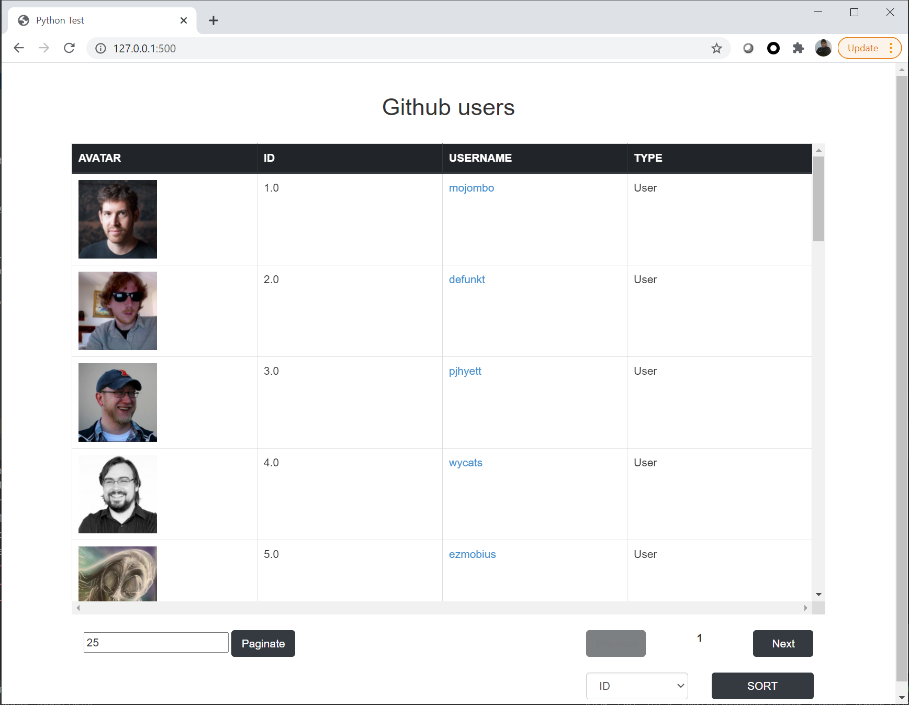

---
# Python Test

Example of a flask application that connect to SQLite Database and the API of GitHub.

---
## Prerequisites

Install:

* Python 3.5 or higher

---

## Installation

To install the application, follow the next steps:

Create an virtual environment:

~~~
python -m venv venv
~~~

Activate the environment:

- Windows
~~~
. venv/Scripts/activate
~~~

- Linux
~~~
. venv/bin/activate
~~~

Install the project as a library

~~~
pip install git+https://github.com/danAguilarZ/python-test.git@main
~~~

Create the configuration file.

Create a file -> `config.yml`

~~~
touch config.yml
~~~ 

And fill the next format with your information

~~~yml
github:
  credentials_:
    username: xxx
    password: xxx
sqlite:
  database: xx
  table: xxx
~~~

---

## Script Populate SQL

Run the script

~~~
python -m populate_sqlite.seed
~~~

The script has two arguments, there are:

| Argument | Contraction | Description |
| --------------- | --------------- | --------------- |
| --total | -t | Total of user to add |
| --config | -c | Path to configuration file |

Example of out:

~~~
$ python -m populate_sqlite.seed

User to insert: (1, 'mojombo', 'User', 'https://avatars0.githubusercontent.com/u/1?v=4', 'https://github.com/mojombo')
User to insert: (2, 'defunkt', 'User', 'https://avatars0.githubusercontent.com/u/2?v=4', 'https://github.com/defunkt')
User to insert: (3, 'pjhyett', 'User', 'https://avatars0.githubusercontent.com/u/3?v=4', 'https://github.com/pjhyett')
User to insert: (4, 'wycats', 'User', 'https://avatars0.githubusercontent.com/u/4?v=4', 'https://github.com/wycats')
User to insert: (5, 'ezmobius', 'User', 'https://avatars0.githubusercontent.com/u/5?v=4', 'https://github.com/ezmobius')
User to insert: (6, 'ivey', 'User', 'https://avatars0.githubusercontent.com/u/6?v=4', 'https://github.com/ivey')
User to insert: (7, 'evanphx', 'User', 'https://avatars0.githubusercontent.com/u/7?v=4', 'https://github.com/evanphx')
User to insert: (17, 'vanpelt', 'User', 'https://avatars1.githubusercontent.com/u/17?v=4', 'https://github.com/vanpelt')
User to insert: (18, 'wayneeseguin', 'User', 'https://avatars0.githubusercontent.com/u/18?v=4', 'https://github.com/wayneeseguin')
User to insert: (19, 'brynary', 'User', 'https://avatars0.githubusercontent.com/u/19?v=4', 'https://github.com/brynary')
$ 
~~~

In case of not receive this out, it could be because you need credentials to go to Github and it could
be wrong if you put it before

Example of wrong credentials:

~~~
$ python -m populate_sqlite.seed

$ 
~~~

## Web API

Run the script

~~~
python -m web --port 500
~~~

The script has two arguments, there are:

| Argument | Contraction | Description |
| --------------- | --------------- | --------------- |
| --port | -p | Port where the application will be running |
| --config | -c | Path to configuration file |
| --size | -s | Default size of github users that will be shown in the page |

Example of out:
~~~
$ python -m web --port 500

 * Serving Flask app "__main__" (lazy loading)
 * Environment: production
   WARNING: This is a development server. Do not use it in a production deployment.
   Use a production WSGI server instead.
 * Debug mode: off
 * Running on http://127.0.0.1:500/ (Press CTRL+C to quit)
~~~

### Test API

In an web explorer put the next URI:

~~~
http://127.0.0.1:500/
~~~

